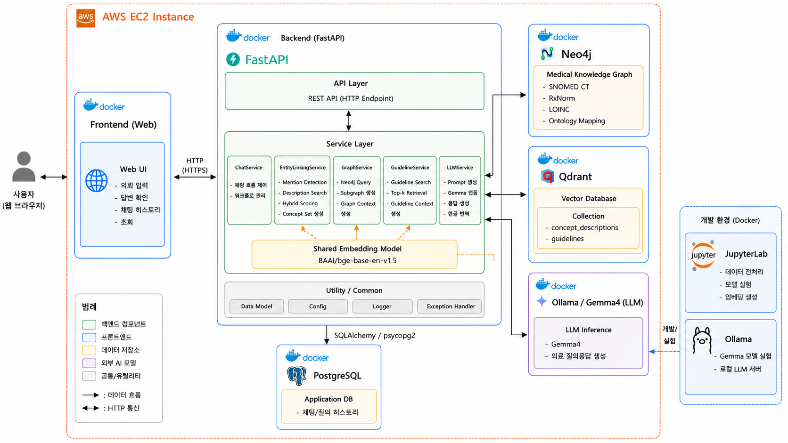
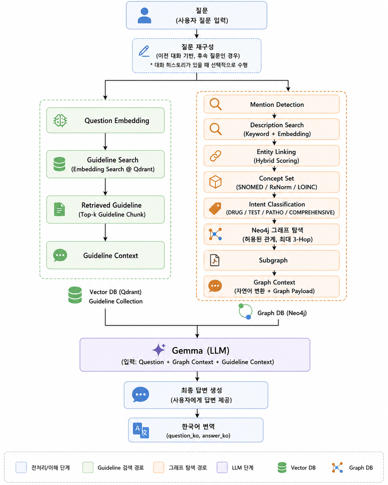
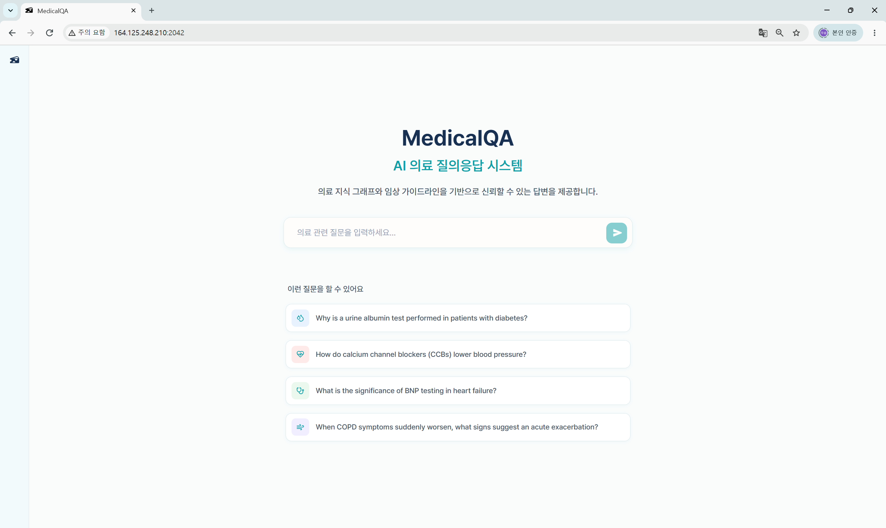
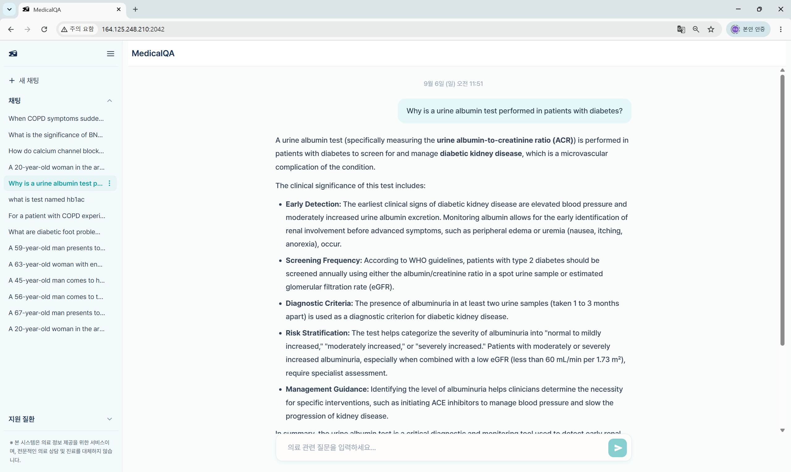
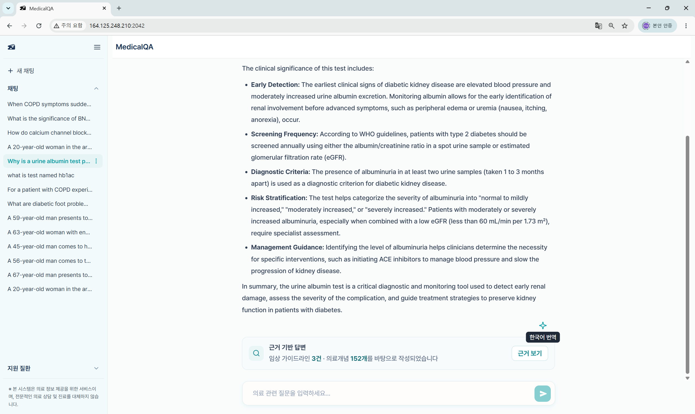
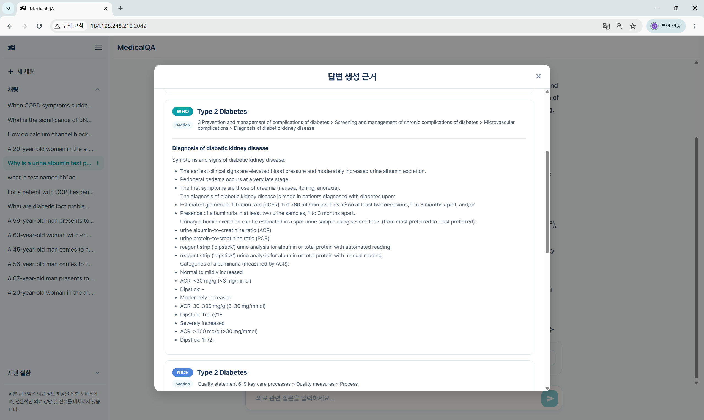
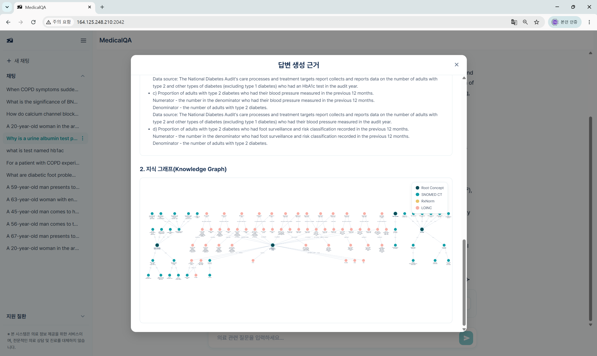

# MedicalQA
### 의료 지식 그래프와 임상 진료지침을 활용한 GraphRAG 기반 의료 질의응답 시스템

> 의료 지식 그래프와 임상 진료지침을 결합하여  
> 의료 질문에 대한 근거 기반 답변을 제공하는 AI 질의응답 시스템

### 1. 프로젝트 배경

#### 문제점

대규모 언어 모델(LLM)은 의료 질의응답에 활용될 수 있지만, 단독으로 사용할 경우 부정확한 답변이 생성되거나 답변의 근거를 충분히 제시하기 어렵다는 한계가 있다. 또한 기존 RAG 방식은 텍스트 유사도 중심으로 정보를 검색하기 때문에 의료 개념 간의 구조적인 관계를 충분히 활용하기 어렵다.

#### 필요성

의료 질의에 대해 보다 신뢰성 있는 답변을 제공하기 위해서는 사용자의 질문에서 의료 개념을 정확하게 식별하고, 의료 지식 간의 관계 정보와 임상 진료지침을 함께 활용하는 검색 방식이 필요하다.

이에 본 프로젝트에서는 의료 지식 그래프 기반 GraphRAG와 임상 진료지침 검색을 결합한 MedicalQA를 개발하였다. 지식 그래프의 구조적 관계 정보와 임상 진료지침의 근거 정보를 함께 검색하여 답변 생성에 활용하도록 설계하였다.

#### 기대효과

의료 질문에 대해 단순히 LLM의 생성 능력에 의존하는 것이 아니라, 의료 지식 그래프와 임상 진료지침을 기반으로 근거를 검색하고 답변을 생성함으로써 보다 근거 기반의 의료 질의응답을 지원한다.

### 2. 개발 목표

#### 2.1. 목표 및 세부 내용

본 프로젝트는 의료 지식 그래프와 임상 진료지침을 결합한 GraphRAG 기반 의료 질의응답 시스템 MedicalQA를 구축하는 것을 목표로 한다.

사용자의 의료 질문에서 주요 의료 개념을 식별하고, 관련 개념을 의료 지식 그래프에서 탐색하는 동시에 임상 진료지침을 검색하여 답변 생성에 활용한다.

주요 개발 내용은 다음과 같다.

* **의료 지식 그래프 구축**
  SNOMED CT, RxNorm, LOINC 등의 의료 표준 용어를 활용하여 의료 개념 및 관계 정보를 Neo4j 기반 지식 그래프로 구축

* **의료 개념 검색 및 연결**
  질문에 포함된 의료 개념을 탐지하고 BM25와 임베딩 기반 Hybrid Search를 통해 관련 개념을 검색

* **GraphRAG 기반 관계 탐색**
  질문의 의도에 따라 지식 그래프의 관련 관계를 탐색하여 의료 개념 간 구조적 정보를 검색

* **임상 진료지침 검색**
  NICE 및 WHO의 임상 진료지침을 전처리하고 벡터 검색을 통해 질문과 관련된 근거 정보를 검색

* **근거 기반 답변 생성**
  지식 그래프에서 검색한 관계 정보와 임상 진료지침을 결합하여 LLM 기반 의료 답변 생성

* **웹 기반 의료 질의응답 서비스 구현**
  React와 FastAPI를 활용하여 사용자가 의료 질문을 입력하고 검색 결과를 바탕으로 생성된 답변을 확인할 수 있는 웹서비스 구현

#### 2.2. 기존 서비스 대비 차별성

MedicalQA는 단순히 LLM의 생성 능력이나 텍스트 유사도 기반 검색에 의존하지 않고, 의료 지식 그래프의 구조적 관계 정보와 임상 진료지침을 함께 활용한다는 점에서 차별성을 가진다.

| 구분              | LLM 단독 | 일반 RAG | MedicalQA |
| --------------- | ------ | ------ | --------- |
| 외부 근거 검색        | ❌      | ○      | ○         |
| 의료 개념 간 관계 활용   | ❌      | 제한적    | **○**     |
| 의료 지식 그래프 활용    | ❌      | ❌      | **○**     |
| 임상 진료지침 활용      | ❌      | △      | **○**     |
| 구조적·문서 기반 근거 결합 | ❌      | △      | **○**     |

**주요 차별점**

* **의료 지식 그래프 기반 관계 검색**
  의료 개념 간의 관계를 그래프 형태로 탐색하여 단순 텍스트 유사도만으로 찾기 어려운 구조적 정보를 활용한다.

* **임상 진료지침과 지식 그래프의 결합**
  그래프에서 확보한 의료 개념 및 관계 정보와 NICE, WHO 등의 임상 진료지침 검색 결과를 함께 활용한다.

* **질문 의도 기반 검색**
  질문의 의도에 따라 약물, 검사, 병리 등 필요한 그래프 관계를 선택적으로 탐색하여 답변에 필요한 정보를 구성한다.

* **근거 기반 답변 생성**
  검색된 의료 지식과 임상 진료지침을 답변 생성 과정에 활용하여 단순 생성형 답변이 아닌 근거 기반의 의료 질의응답을 지원한다.

### 3. 시스템 설계

#### 3.1. 시스템 구성도

MedicalQA는 React 기반 웹 프론트엔드와 FastAPI 기반 백엔드를 중심으로 구성되며, 
Neo4j 의료 지식 그래프, Qdrant 벡터 데이터베이스, PostgreSQL, Ollama/Gemma 등의 
서비스를 연계하여 의료 질의응답을 처리한다.

각 구성요소는 Docker 컨테이너로 분리하고 Docker Compose를 통해 통합 실행할 수 있도록 구성하였다.

#### 3.2. 사용 기술

| 구분              | 기술                            | 주요 역할                   |
| --------------- | ----------------------------- | ----------------------- |
| Frontend        | React, Vite                   | 웹 사용자 인터페이스 구현          |
| Backend         | FastAPI, Python               | REST API 및 질의응답 처리      |
| LLM             | Gemma4, Ollama                | 의료 질의응답 생성 및 번역         |
| Knowledge Graph | Neo4j 5 Community             | 의료 지식 그래프 저장 및 그래프 탐색   |
| Vector DB       | Qdrant                        | 의료 개념 및 임상 진료지침 벡터 검색   |
| Database        | PostgreSQL 17                 | 채팅 및 메시지 데이터 저장         |
| Embedding       | BAAI/bge-base-en-v1.5         | 의료 개념 및 문서 임베딩          |
| NLP             | SciSpacy, en_core_sci_scibert | 의료 개념 Mention Detection |
| Search          | BM25, Embedding Search        | 의료 개념 Hybrid Search     |
| Data            | SNOMED CT, RxNorm, LOINC      | 의료 표준 용어 및 지식 그래프 구축    |
| Guideline       | NICE, WHO                     | 임상 진료지침 데이터 구축          |
| Infrastructure  | Docker, Docker Compose        | 서비스 컨테이너화 및 통합 실행       |

### 4. 개발 결과

#### 4.1. 전체 시스템 흐름도

MedicalQA는 사용자의 질문을 입력받아 **질문 재구성 → 의료 개념 탐지 및 Entity Linking → 지식 그래프 탐색과 임상 진료지침 검색 → Graph Context 및 Guideline Context 구성 → Gemma 기반 답변 생성**의 과정을 거쳐 최종 답변을 제공한다.

질문과 관련된 의료 지식은 Neo4j 기반 지식 그래프에서 탐색하고, 임상 진료지침은 Qdrant 기반 벡터 검색을 통해 가져온다. 검색된 두 종류의 근거 정보를 LLM에 함께 제공하여 답변을 생성하도록 구성하였다.

#### 4.2. 기능 설명 및 주요 기능 명세서

##### 4.2.1. 의료 질의응답

사용자는 웹 인터페이스에서 의료 관련 질문을 입력할 수 있으며, 입력된 질문은 백엔드의 질의응답 파이프라인을 통해 처리된다. 질문 분석 및 의료 지식·임상 진료지침 검색을 수행한 후, 검색된 근거를 기반으로 Gemma가 답변을 생성한다.

생성된 답변은 사용자가 이해하기 쉽도록 한국어로 제공하며, 대화형 인터페이스를 통해 연속적인 질의응답을 지원한다.

* **입력:** 사용자 의료 질문
* **처리:** 질문 재구성 및 의료 지식·임상 진료지침 검색
* **답변 생성:** Graph Context + Guideline Context 기반 AI 답변 생성
* **출력:** 근거 기반 AI 답변 및 한국어 번역
* **대화:** 이전 대화 내용을 기반으로 한 연속 질의응답 지원

생성된 답변 하단에서는 답변에 활용된 임상 진료지침과 의료 지식 정보를 확인할 수 있도록 **답변 생성 근거**를 제공한다.

##### 4.2.2. 근거보기 화면 01 - 임상 진료지침

질문과 관련된 NICE 및 WHO 임상 진료지침을 검색하여 답변 생성에 활용하며, 사용자는 검색된 진료지침의 출처와 관련 내용을 확인할 수 있다.

##### 4.2.3. 근거보기 화면 02 - 의료 지식 그래프 시각화

질문과 관련된 의료 개념 및 관계를 Neo4j 기반 지식 그래프로 탐색하고, 검색된 노드와 관계를 시각적으로 확인할 수 있다.

이를 통해 질환, 약물, 검사 등 의료 개념 간의 관계 정보를 직관적으로 확인할 수 있다.

##### 4.2.4. 채팅 이력 관리

사용자의 질의응답 기록을 저장하여 기존 대화를 다시 확인할 수 있으며, 채팅 목록을 통해 이전 대화에 접근할 수 있도록 구현하였다.

* 새로운 채팅 생성
* 기존 채팅 조회
* 채팅 제목 변경
* 채팅 삭제

#### 4.3. 성능평가

MedicalQA의 성능을 평가하기 위해 의료 객관식 질의응답 데이터셋 **MedQA**를 활용하고, 동일한 **Gemma4:12b**를 사용하는 Gemma4-only와 MedicalQA의 답변 정확도를 비교하였다.

| 구분            | 정답 문항 수 | 전체 평가 항목 |         정확도 |
| ------------- | ------: | -------: | ----------: |
| Gemma4-only   |     237 |      330 |       71.8% |
| **MedicalQA** | **276** |  **330** |   **83.6%** |
| 변화            |     +39 |        - | **+11.8%p** |

MedicalQA는 동일한 LLM을 사용하면서 의료 지식 그래프와 임상 진료지침 검색 결과를 추가적으로 활용하였으며, 평가 결과 Gemma4-only 대비 **11.8%p 높은 정확도**를 기록하였다.

#### 4.4. 디렉토리 구조

### 5. 설치 및 실행 방법

#### 5.1. 설치절차 및 실행 방법

### 6. 소개 자료 및 시연 영상

#### 6.1. 프로젝트 소개 자료

[프로젝트 소개 자료](./docs/03.발표자료/발표자료.pdf)

#### 6.2. 시연 영상

### 7. 팀구성
| 성명  | 구성원별 역할                                                                                                                                                         |
| --- | --------------------------------------------------------------------------------------------------------------------------------------------------------------- |
| 김채은 | - 의료 온톨로지 데이터 전처리 및 검색 인덱스 구축 - Hybrid Search 및 Entity Linking 구현 - 임상 진료지침 전처리 및 Guideline Retrieval 구현 - LLM 연동 및 프롬프트 설계 - 전체 파이프라인 조립 및 모듈 통합   |
| 신우솜 | - MedicalQA 웹 인터페이스 개발 - 임상 진료지침 및 지식 그래프 기반 근거정보 시각화 - FastAPI 백엔드 API 및 데이터 연동 - PostgreSQL 기반 채팅 데이터 관리 기능 구현 - Gemma4-only와 MedicalQA의 정성 비교 평가 |
| 이정현 | - 의료 온톨로지 데이터 전처리 및 매핑 - 의료 지식 그래프 구축 및 Neo4j 적용 - 질문 의도 기반 Graph Query 설계 - Graph Context 생성 모듈 구현 - GraphRAG 파이프라인 통합 모듈 구성                       |

### 8. 참고 문헌 및 출처

#### 논문 및 기술 문헌

1. Robertson, S. & Zaragoza, H. (2009). *The Probabilistic Relevance Framework: BM25 and Beyond.*
2. Han, H. et al. (2025). *Retrieval-Augmented Generation with Graphs (GraphRAG).*
3. Xiao, S. et al. (2024). *C-Pack: Packed Resources for General Chinese Embeddings.*
4. Reimers, N. & Gurevych, I. (2019). *Sentence-BERT: Sentence Embeddings Using Siamese BERT-Networks.*
5. Neumann, M. et al. (2019). *ScispaCy: Fast and Robust Models for Biomedical Natural Language Processing.*

#### 의료 데이터 및 임상 진료지침

* **SNOMED CT** — 의료 임상 개념 및 관계 데이터
* **RxNorm** — 의약품 및 약물 개념 데이터
* **LOINC** — 임상검사 및 관찰 항목 데이터
* **NICE (National Institute for Health and Care Excellence)** — Type 2 Diabetes, Hypertension, COPD, CKD, Chronic Heart Failure 임상 진료지침
* **WHO (World Health Organization)** — Type 2 Diabetes, Hypertension 임상 진료지침

#### 모델 및 오픈소스

* **SciSpaCy** — Biomedical Natural Language Processing
* **d4data/biomedical-ner-all** — Biomedical Named Entity Recognition
* **Gemma** — Google DeepMind의 오픈 LLM
* **BAAI/bge-base-en-v1.5** — Sentence Embedding Model
